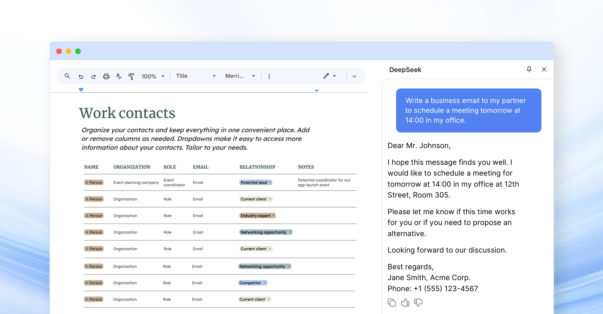

  

<h1 align="center">DeepSeek AI</h1>

  

  <strong>DeepSeek AI</strong> is an advanced artificial intelligence assistant designed to automate tasks, optimize workflows, and provide intelligent insights.  
  Whether you're a developer, researcher, writer, or business professional, DeepSeek helps streamline processes, solve problems, and increase productivity.

---

## **📸 How DeepSeek AI Works**  

  
  

DeepSeek AI integrates directly into your browser, allowing you to chat with AI, generate content, and get coding assistance—all without switching tabs.  

---

## **🛠️ Personalization for a Smarter Experience**  

  

    
<strong>With DeepSeek AI’s personalization feature</strong>, you can tailor how the assistant interacts with you.  
    Customize:

    <ul>
      <li><strong>Preferred response style</strong> (concise, detailed, professional, casual).</li>
      <li><strong>Language preferences</strong> for multilingual support.</li>
      <li><strong>Task-specific instructions</strong> (e.g., "always summarize in bullet points").</li>
    </ul>
  

  

    
  

---

## **✨ Why Use DeepSeek?**  

DeepSeek AI is a powerful tool that integrates **machine learning and natural language processing**, helping users handle complex tasks with ease.  

- **Chatbot** – Engage in meaningful AI-powered conversations that provide insightful responses.  
- **Coding Assistant** – Generate, debug, and optimize code with AI-driven assistance.  
- **Research Automation** – Analyze vast amounts of data and extract key insights effortlessly.  
- **Writing Support** – Improve writing quality, structure, and clarity in any document.  
- **Task Optimization** – Automate repetitive processes to save time and effort.  
- **Cross-Platform Integration** – Use DeepSeek seamlessly on various browsers and devices.  

---

## **🔧 Installation**  

1️⃣ **Download the Extension** – Click the **Install Now** button above or visit the [Chrome Web Store](https://chromewebstore.google.com/detail/deepseek-ai/npphdmcakmfhllhblkealgkeefamebih).  
2️⃣ **Add to Your Browser** – Follow the simple installation steps.  
3️⃣ **Start Using DeepSeek** – Click the extension icon to begin leveraging in your workflow.  

---

## **🚀 DeepSeek AI – Your Companion for Productivity**  

  

### **🔹 Core Features**  

DeepSeek offers a robust **AI-powered toolkit** for professionals, developers, and researchers looking to optimize their work.  

- **Smart Chat** – Get detailed answers, insights, and automated responses in real time.  
- **Coding Assistant** – Receive suggestions, debugging help, and optimized code snippets.  
- **Research & Data Analysis** – Extract information from large text sources quickly and accurately.  
- **Writing Enhancement** – Improve grammar, sentence structure, and content flow.  
- **Process Automation** – Automate daily tasks, from email drafting to data processing.  

---

## **📚 Practical Use Cases**  

### **DeepSeek-Assisted Development**  

DeepSeek AI is an invaluable **coding assistant** that helps developers:  
- Identify and fix programming errors.  
- Generate code snippets in various languages.  
- Understand complex programming concepts with detailed explanations.  

### **Research & Knowledge Extraction**  

If you're working with **scientific papers, reports, or large datasets**, DeepSeek AI:  
- Summarizes long-form content in seconds.  
- Extracts meaningful insights from raw data.  
- Helps analysts and researchers spot patterns and trends quickly.  

### **AI-Powered Content Writing**  

DeepSeek AI refines and enhances your writing by:  
- Correcting grammar, punctuation, and sentence flow.  
- Generating ideas for blog posts, reports, or business content.  
- Providing structure and clarity for technical and academic writing.  

### **Workflow Automation**  

Automate repetitive tasks such as **email responses, scheduling, and document organization**.  
DeepSeek helps professionals focus on high-value work by handling routine operations.  

---

## **🔄 Continuous Evolution & Future Updates**  

DeepSeek AI is constantly evolving with **new features and optimizations**. Future updates will include:  

- **Enhanced Chat** – More natural and context-aware responses.  
- **Expanded Coding Capabilities** – Support for more programming languages and frameworks.  
- **Advanced Research Tools** – Deeper integration for knowledge extraction and trend analysis.  
- **Better Writing Assistance** – More AI-driven improvements for long-form content.  

By keeping up with advancements, DeepSeek AI ensures **a smarter and more efficient user experience**.  

---

## **🏆 How DeepSeek AI Stands Out**  

Unlike many AI tools that offer **basic chatbot functionality**, DeepSeek AI is designed to **integrate deeply** with your workflow. Here’s why it stands out:  

- **Context Retention** – Remembers previous interactions for more relevant responses.  
- **Multi-Tasking** – DeepSeek can handle multiple types of queries at once.  
- **Customizability** – Tailor AI settings to match your specific needs and work habits.  
- **Real-Time Performance** – Provides responses in milliseconds, keeping your workflow smooth.  

DeepSeek AI isn’t just a chatbot – **it’s a comprehensive AI-powered assistant** designed for **maximum efficiency and productivity**.  

---

## **🔗 Links & Resources**  

- **[Install DeepSeek AI from Chrome Web Store](https://chromewebstore.google.com/detail/deepseek-ai/npphdmcakmfhllhblkealgkeefamebih)**  
- **[Visit the Official Website](https://deepseekai.works/)**  
- **[Explore the GitHub Repository](https://github.com/egmalt/deepseek-ai)**  

---

## **🎯 Get Started with DeepSeek AI Today!**  

DeepSeek AI **eliminates redundant tasks and enhances decision-making** with its AI-driven capabilities. Whether you're looking for **a chatbot, a coding assistant, or a research tool**, DeepSeek AI is the solution for your productivity needs.  

  

