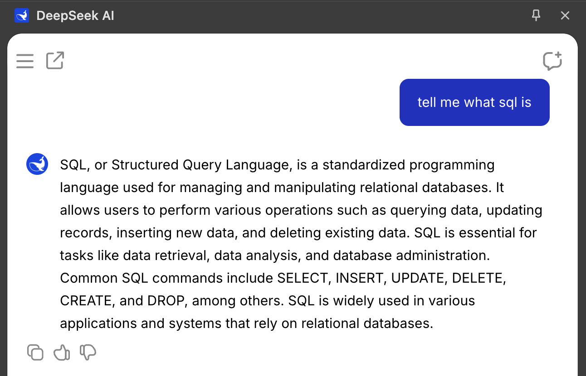

  

<h1 align="center">DeepSeek AI</h1>

  

  <strong>DeepSeek AI</strong> is an advanced artificial intelligence assistant designed to automate tasks, optimize workflows, and provide intelligent insights.  
  Whether you're a developer, researcher, writer, or business professional, DeepSeek helps streamline processes, solve problems, and increase productivity.

---

## 📌 How DeepSeek AI Works  

  

DeepSeek AI integrates directly into your browser, allowing you to:  

1. Chat with AI and get instant responses.  
2. Generate content without switching tabs.  
3. Receive coding assistance and debugging support.  
4. Automate repetitive tasks efficiently.  

---

## 📌 Installation  

### Step-by-Step Guide  

  

1. Click the **Install Now** button above or visit the [Chrome Web Store](https://chromewebstore.google.com/detail/deepseek-ai/npphdmcakmfhllhblkealgkeefamebih).
2. Follow the on-screen instructions to add DeepSeek AI to your browser.
3. Pin the extension for quick access.
4. Click the DeepSeek AI icon to start using AI-powered tools instantly.

---

## 📌 Personalization for a Smarter Experience  

  

With **DeepSeek AI’s personalization feature**, you can customize how the assistant interacts with you:

1. **Set response style** – Choose between concise, detailed, professional, or casual replies.
2. **Select language preferences** – Multilingual support ensures seamless interactions.
3. **Task-specific instructions** – Define how AI should respond (e.g., "always summarize in bullet points").

These settings allow DeepSeek AI to adapt to your workflow and improve productivity.

---

## 📌 Why Use DeepSeek?  

DeepSeek AI integrates **machine learning and natural language processing** to help users with:  

1. **Chatbot Conversations** – Get instant, meaningful AI responses.  
2. **Coding Assistance** – Generate, debug, and optimize code with AI-driven suggestions.  
3. **Research & Analysis** – Extract key insights from large datasets.  
4. **Content Writing** – Improve structure, clarity, and engagement in documents.  
5. **Task Automation** – Eliminate repetitive manual work.  
6. **Seamless Integration** – Works across different browsers and devices.  

---

## 📌 DeepSeek AI – Your Companion for Productivity  

  

### 📌 Core Features  

DeepSeek AI is designed to optimize workflows with:  

1. **Smart Chat** – Provides real-time answers and contextual responses.  
2. **Coding Support** – Helps debug, optimize, and generate code.  
3. **Automated Research** – Summarizes complex topics and extracts data.  
4. **Writing Assistance** – Enhances grammar, sentence structure, and content quality.  
5. **Process Optimization** – Automates workflows and repetitive tasks.  

---

## 📌 Practical Use Cases  

### DeepSeek-Assisted Development  

DeepSeek AI helps developers with:  
1. Debugging and error detection.  
2. Generating code snippets in multiple programming languages.  
3. Understanding complex programming concepts.  

### AI for Research & Data Processing  

Researchers and analysts can use DeepSeek AI to:  
1. Summarize lengthy academic papers.  
2. Extract key data points for reports.  
3. Identify patterns and trends in datasets.  

### AI-Powered Writing  

DeepSeek AI improves writing by:  
1. Correcting grammar and punctuation.  
2. Generating creative ideas for blog posts and business content.  
3. Structuring academic and professional documents.  

### Workflow Automation  

Professionals can automate tasks such as:  
1. Email drafting and scheduling.  
2. Document organization and structuring.  
3. Streamlining repetitive content creation processes.  

---

## 📌 Continuous Evolution & Future Updates  

DeepSeek AI is constantly evolving with new features, including:  

1. **Improved AI Conversations** – More natural and context-aware responses.  
2. **Enhanced Coding Support** – Broader programming language assistance.  
3. **Advanced Research Tools** – Improved data extraction and summarization.  
4. **Better Writing Assistance** – AI-driven grammar and clarity enhancements.  

---

## 📌 How DeepSeek AI Stands Out  

DeepSeek AI differs from standard chatbots by offering:  

1. **Context Retention** – Understands previous conversations for more relevant responses.  
2. **Multi-Tasking Capabilities** – Handles multiple queries at once.  
3. **Customization Options** – Adapts to individual user preferences.  
4. **Real-Time Speed** – Delivers instant AI-generated responses.  

DeepSeek AI is more than a chatbot—it's a **fully integrated AI assistant** for professionals.  

---

## 📌 Links & Resources  

- **[Install DeepSeek AI from Chrome Web Store](https://chromewebstore.google.com/detail/deepseek-ai/npphdmcakmfhllhblkealgkeefamebih)**  
- **[Visit the Official Website](https://deepseekai.works/)**  
- **[Explore the GitHub Repository](https://github.com/egmalt/deepseek-ai)**  

---

## 📌 Get Started with DeepSeek AI Today!  

DeepSeek AI **enhances productivity, simplifies tasks, and provides AI-driven insights**.  

  

