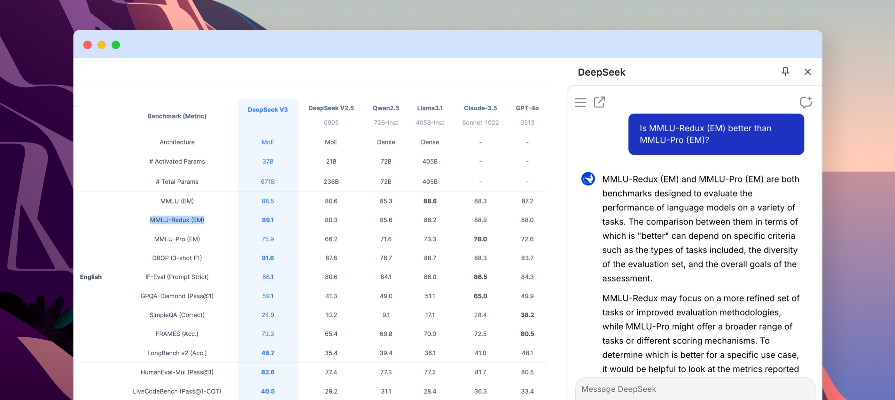
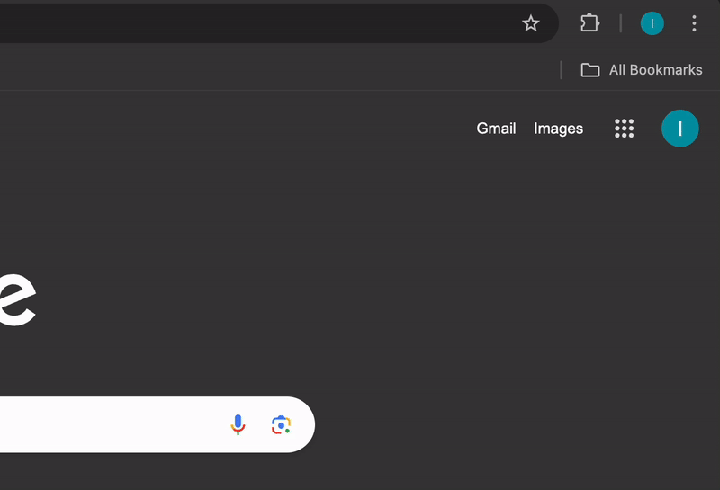
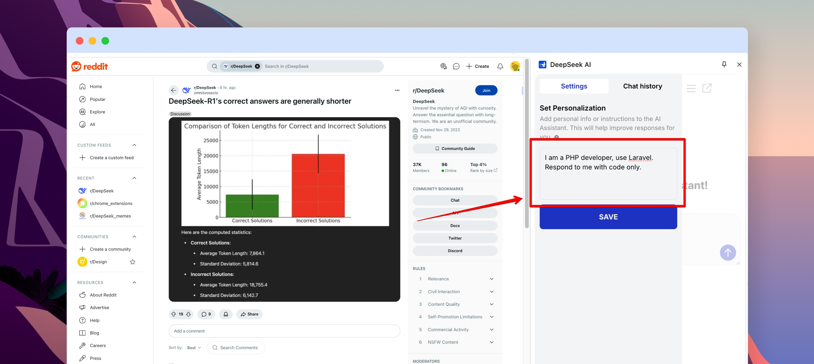
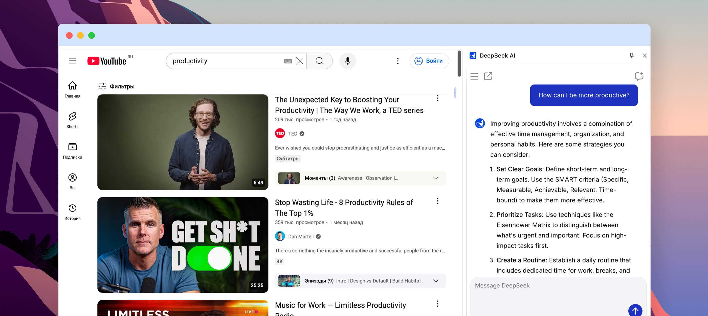
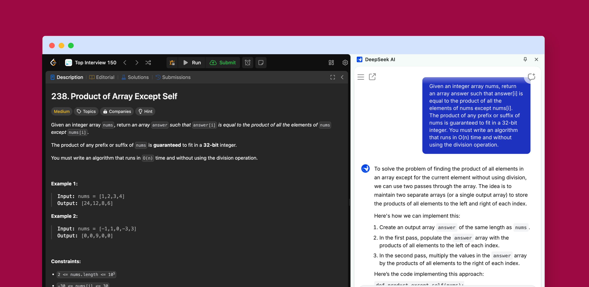
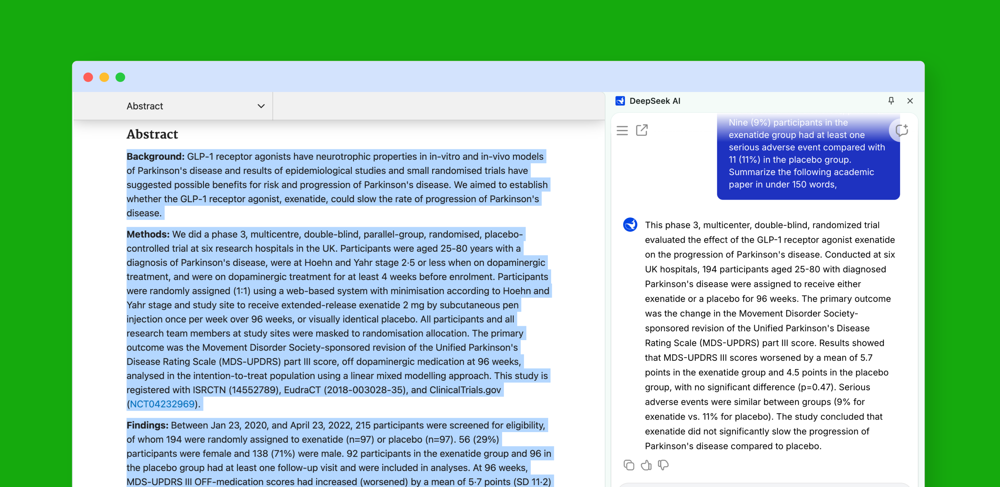
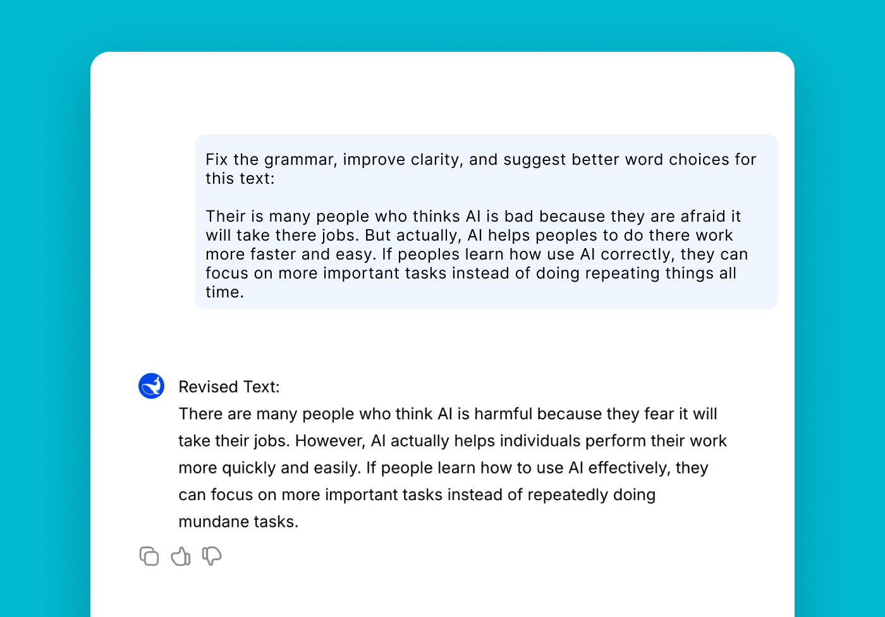
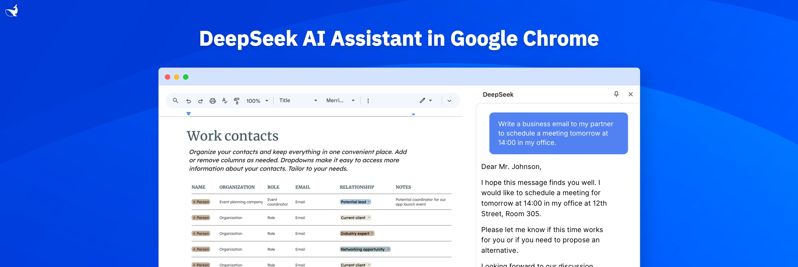

  <a href="https://chromewebstore.google.com/detail/deepseek-ai/npphdmcakmfhllhblkealgkeefamebih?utm_source=github&utm_medium=display_f&utm_campaign=deepseek_chrome">
  

<h1 align="center">DeepSeek AI</h1>

  

  <strong>DeepSeek AI</strong> is an advanced artificial intelligence assistant designed to automate tasks, optimize workflows, and provide intelligent insights.  
  Whether you're a developer, researcher, writer, or business professional, DeepSeek helps streamline processes, solve problems, and increase productivity.

---

## How DeepSeek Works? 

    <a href="https://chromewebstore.google.com/detail/deepseek-ai/npphdmcakmfhllhblkealgkeefamebih?utm_source=github&utm_medium=display_f&utm_campaign=deepseek_chrome">
  

DeepSeek AI integrates directly into your browser, allowing you to:  

- Chat with AI and get instant responses.  
- Generate content without switching tabs.  
- Receive coding assistance and debugging support.   
- Enhance creativity with powered brainstorming.

---

## Installation  

### Step-by-Step Guide  

  <a href="https://chromewebstore.google.com/detail/deepseek-ai/npphdmcakmfhllhblkealgkeefamebih?utm_source=github&utm_medium=display_f&utm_campaign=deepseek_chrome">
  

1. Install via [Chrome Web Store](https://chromewebstore.google.com/detail/deepseek-ai/npphdmcakmfhllhblkealgkeefamebih?utm_source=github&utm_medium=display_f&utm_campaign=deepseek_chrome)  
2. Add DeepSeek to browser  
3. Pin for quick access
4. Click the icon to start  
5. Customize settings  
6. Use AI tools daily  

---

## Personalization for a Smarter Experience  

  <a href="https://chromewebstore.google.com/detail/deepseek-ai/npphdmcakmfhllhblkealgkeefamebih?utm_source=github&utm_medium=display_f&utm_campaign=deepseek_chrome">
  

With **DeepSeek AI’s personalization feature**, you can customize how the assistant interacts with you:

1. Set response style – Choose between concise, detailed, professional, or casual replies.  
2. Select language preferences – Multilingual support ensures seamless interactions.  
3. Define task-specific instructions – (e.g., "always summarize in bullet points").  
4. Enable topic prioritization – Focus on areas like tech, finance, or science.  
5. Refine accuracy levels – Adjust DeepSeek settings to improve precision.  

These settings allow DeepSeek AI to **adapt to your needs and enhance productivity**.

---

## Why Use DeepSeek?  

DeepSeek AI integrates **machine learning and natural language processing** to help users with:  

- Coding Assistance – Generate, debug, and optimize code effortlessly, making development faster and more efficient.

- Research & Analysis – Extract valuable insights from vast datasets, helping you make data-driven decisions with ease.

- Task Automation – Automate repetitive manual work, freeing up time for more important tasks and increasing productivity.

- AI-Driven Summaries – Convert complex text into clear and concise insights, making information easier to understand and act upon. 

---

## DeepSeek AI – Your Companion for Productivity  

  <a href="https://chromewebstore.google.com/detail/deepseek-ai/npphdmcakmfhllhblkealgkeefamebih?utm_source=github&utm_medium=display_f&utm_campaign=deepseek_chrome">
  

### Core Features  

DeepSeek AI is **designed to optimize workflows** with:  

1. Smart Chat – Provides real-time answers and contextual responses.  
2. Coding Support – Helps debug, optimize, and generate code.  
3. Automated Research – Summarizes complex topics and extracts data.  
4. Writing Assistance – Enhances grammar, sentence structure, and content quality.  
5. Process Optimization – Automates workflows and repetitive tasks.  
6. Integrated Tools – Seamlessly connects with applications to boost efficiency.  

---

## Practical Use Cases  

### DeepSeek-Assisted Development  

Write Better Code
Whether you're debugging, refactoring, or understanding a new concept, DeepSeek is like a senior dev reviewing your code—always ready to guide you toward the best solution.

  <a href="https://chromewebstore.google.com/detail/deepseek-ai/npphdmcakmfhllhblkealgkeefamebih?utm_source=github&utm_medium=display_f&utm_campaign=deepseek_chrome">
  

### AI for Research & Learning 

Academic papers are packed with valuable knowledge, but digesting them takes time. DeepSeek instantly processes complex studies, extracting key findings and summarizing them in a clear, concise format.

  <a href="https://chromewebstore.google.com/detail/deepseek-ai/npphdmcakmfhllhblkealgkeefamebih?utm_source=github&utm_medium=display_f&utm_campaign=deepseek_chrome">
  

### AI-Powered Writing  

  <a href="https://chromewebstore.google.com/detail/deepseek-ai/npphdmcakmfhllhblkealgkeefamebih?utm_source=github&utm_medium=display_f&utm_campaign=deepseek_chrome">
  

### Workflow Automation  

Professionals can automate tasks such as: 
 
1. Automating repetitive writing tasks such as drafting emails, reports, and responses.
2. Organizing and structuring business documents with predefined templates and formatting.
3. Managing customer inquiries with AI-driven responses that provide quick and accurate support.
4. Generating summaries and reports in seconds, turning raw data into actionable insights.

---

## Continuous Evolution & Future Updates  

DeepSeek AI is:  

- More natural AI conversations with enhanced context awareness.  
- Broader coding language support for developers.  
- Improved research tools for extracting and summarizing data.  
- Expanded writing assistance for better grammar and style suggestions.  
- Additional personalization settings to fine-tune user preferences.  
- AI-powered translations to support more languages.  

---

## How Does DeepSeek AI Stand Out?

**Q: How is DeepSeek AI different from regular chatbots?**

A: Unlike standard chatbots, DeepSeek AI remembers past conversations, providing smarter and more contextual responses.

**Q: Can DeepSeek AI handle multiple tasks at once?**

A: Yes! It efficiently manages multiple requests simultaneously, making it perfect for multitasking professionals.

**Q: Is DeepSeek AI customizable?**

A: Absolutely! You can tailor its behavior and responses to match your specific workflow and preferences.

**Q: How fast is DeepSeek AI?**

A: Lightning-fast! Expect instant AI-generated replies, helping you stay productive without delays.

**Q: Is DeepSeek AI easy to use?**

A: Yes, it’s designed for a seamless user experience, combining simplicity, intuition, and efficiency.

**DeepSeek AI** isn’t just another chatbot—it’s a fully integrated AI assistant built for professionals who need smarter, faster, and more personalized AI support.

  <a href="https://chromewebstore.google.com/detail/deepseek-ai/npphdmcakmfhllhblkealgkeefamebih?utm_source=github&utm_medium=display_f&utm_campaign=deepseek_chrome">
  

---

## Links & Resources  

- **[Install DeepSeek AI from Chrome Web Store](https://chromewebstore.google.com/detail/deepseek-ai/npphdmcakmfhllhblkealgkeefamebih?utm_source=github&utm_medium=display_f&utm_campaign=deepseek_chrome)**  
- **[Visit the Official Website](https://deepseekai.works/)**  
- **[Explore the GitHub Repository](https://github.com/deepseek-ai-chat/extension)**  

---

## Get Started with DeepSeek Today!  

DeepSeek AI enhances productivity, simplifies tasks, and provides AI-driven insights.  

  

